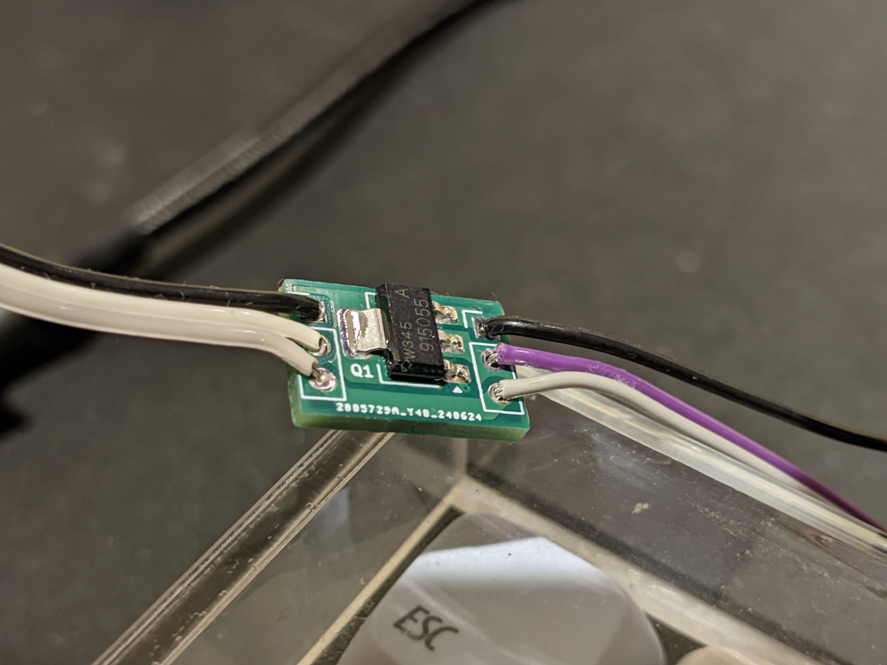

# babydriver

License: CC BY-SA 4.0

A small but capable force feedback board for use with GUN4IR and OpenFIRE light guns.

## BOM

| Reference | Part desc / number | Notes |
|----------|-------------|-------|
| Q1 | BUK98150-55A - [Mouser](https://www.mouser.com/ProductDetail/Nexperia/BUK98150-55A-CUF?qs=Yna0arPQ0CRUeN6OsRm%252BFA%3D%3D) / [LCSC](https://lcsc.com/product-detail/MOSFETs_Nexperia-BUK98150-55A-CUF_C458219.html) |  |
| D1 | RF201LAM2STR  - [Mouser](https://www.mouser.co.uk/ProductDetail/ROHM-Semiconductor/RF202LAM2STFTR?qs=HXFqYaX1Q2zHR%252BhwlkXHhw%3D%3D) / [LCSC](https://lcsc.com/product-detail/Fast-Recovery-High-Efficiency-Diodes_ROHM-Semicon-RF202LAM2STFTR_C5336592.html) | RF202LAM2S or RF302LAM2S will work fine too|
| C1 | 0.1uF | [Mouser](https://www.mouser.co.uk/ProductDetail/YAGEO/CC0603KRX7R9BB104?qs=vTakOoo5QyLvVCYM2ge8LQ%3D%3D) / [LCSC](https://www.lcsc.com/product-detail/_YAGEO-_C14663.html) | |
| R1 | 1K 0603 - [Mouser](https://www.mouser.co.uk/ProductDetail/YAGEO/RC0603FR-071KL?qs=VU8sRB4EgwApHsk4rF%2F3zg%3D%3D) / [LCSC](https://lcsc.com/product-detail/Chip-Resistor-Surface-Mount_YAGEO-RC0603FR-071KL_C22548.html) | |
| R2 | 100K 0603 - [Mouser](https://www.mouser.co.uk/ProductDetail/YAGEO/RC0603FR-07100KL?qs=e1ok2LiJcmaihem8Va5%2Fsw%3D%3D) / [LCSC](https://lcsc.com/product-detail/Chip-Resistor-Surface-Mount_YAGEO-RC0603FR-07100KL_C14675.html) |  |

## Assembly

Considering the board is roughly the size of an SD card, the design uses 4 layers to increase thermal mass and keep the MOSFET cool during operation.
There are also no thermal reliefs due to these space constraints, so be prepared for the board to sink some heat while soldering!

Simply solder all components and wire (looking at the side of the board with the labels):

Left side:
- G: Ground - Microcontroller ground
- S: Solenoid / rumble motor (polarity typically doesn't matter but the outer hole is positive, while the middle pad is GND when the MOSFET is active)

Right side (input):
- G: Ground - external power supply ground (can be omitted if not using an external power supply)
- D: Data pin to activate rumble / solenoid
- +: Power for force feedback
    - For solenoid, this will be the +12/+24V from your external power supply
	- For most rumble setups, this can be wired to the 3.3/5V on your microcontroller, depending on the voltage rating and power draw of the motor.
